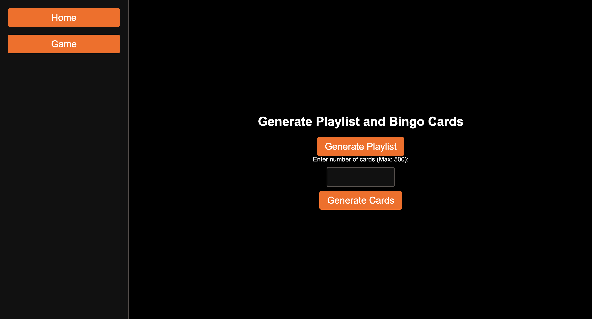
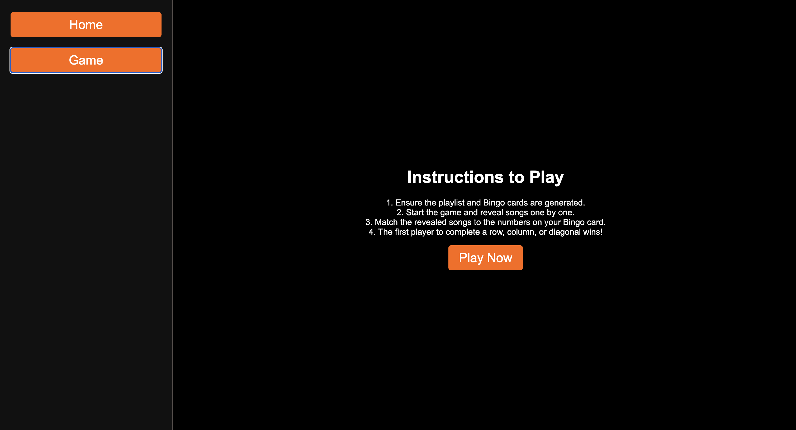
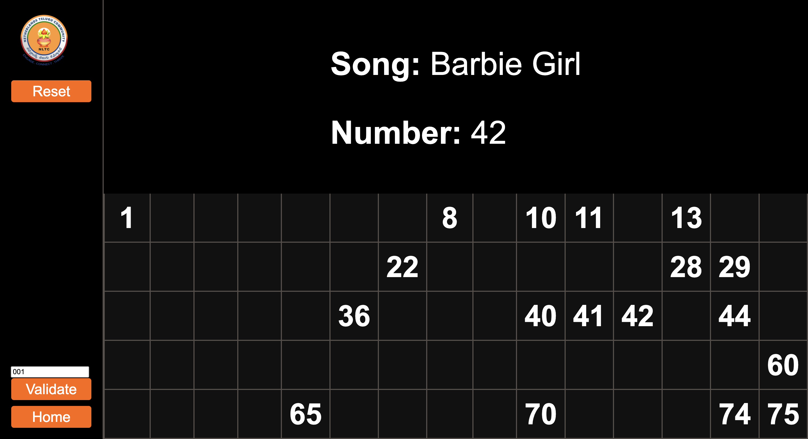
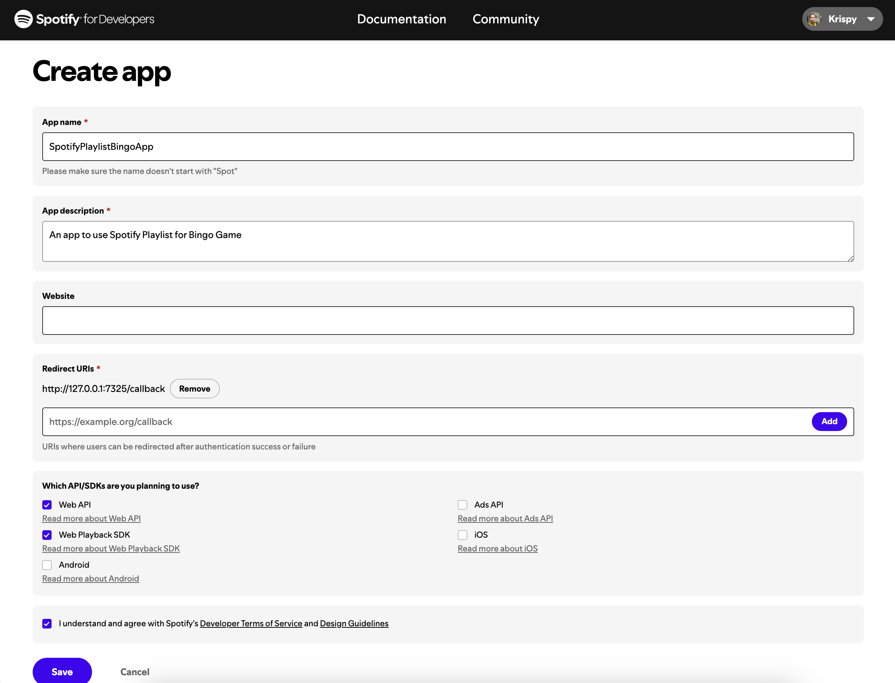
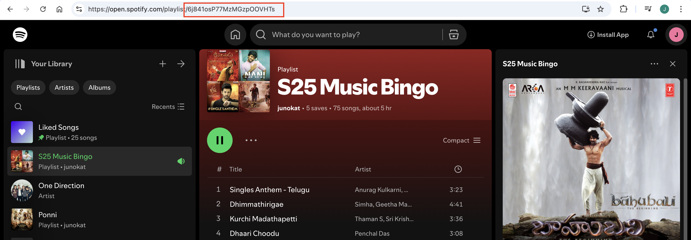

# Spotify-Bingo

This is a Flask-based web application for playing a music-themed bingo game. The app integrates with the Spotify API to fetch currently playing songs and allows players to validate bingo cards against the playlist.





---

## Features

- Fetch any playlist and generate cards based on the playlist.
- Integration with Spotify API to fetch the currently playing track.
- Ability to reveal or hide songs during gameplay.
- Validate bingo cards from an Excel sheet containing card data.
- Store song data in a CSV file.


---

## Prerequisites

Before running the application, ensure you have the following installed:

- Python 3.8+
- pip (Python package manager)

---

## Installation and Setup

1. Clone the repository:

   ```bash
   git clone <repository_url>
   cd <repository_directory>
   ```

2. Install the required Python packages:

   ```bash
   pip install -r requirements.txt
   ```

3. Replace the `CLIENT_ID`, `CLIENT_SECRET`, `PLAYLIST_ID` values in the `.env` file with your Spotify API credentials.



   ### Setting up Spotify API

   To use the Spotify API, follow these steps:

   1. Go to the [Spotify Developer Dashboard](https://developer.spotify.com/dashboard/).
   2. Log in with your Spotify account.
   3. Click **Create an App** and fill in the required details (e.g., App Name, Description).
   4. After creating the app, go to the app’s **Settings** and set the **Redirect URI** to:
      ```
      http://127.0.0.1:7325/callback
      ```
   5. Note down the **Client ID** and **Client Secret** from the app’s dashboard.
   6. Replace the placeholder values in the `.env` file with these credentials.

   For PLAYLIST_ID, you will find the ID in URL of a given playlist.

   

Note: If you would like, I can also add you to my current spotify app.

4. Ensure the following files and directories exist:

   - File named `songs.csv, playlist.csv, MusicBingoCards.xlsv` will be created automatically upon first used.

---

## Running the Application

1. Start the Flask application:

   ```bash
   python NLTCMusicBingo.py
   ```

2. Open your browser and go to:

   ```
   http://127.0.0.1:7325/
   ```

3. Log in with your Spotify account to authorize the app.

4. Enjoy the Music Bingo game

5. To restart the game, delete the `songs.csv` file

---

## Packages Used

Here are the main Python packages required for the project:

- **Flask**: Web framework to build the application.
- **Requests**: For making HTTP requests to Spotify APIs.
- **pandas**: For handling and validating bingo card data stored in Excel files.
- **openpyxl**: For reading and writing Excel files.
- **python-dotenv**: For managing environment variables.

Install these dependencies using:

```bash
pip install flask requests pandas openpyxl python-dotenv
```
---

## Enhancements

1. When clicked on validate, currently it only displays the bingo cards. Instead we can highlight the number by comparing the numbers in songs.csv for easy validation.

---


## Author

Developed by Jyothsna Priya Kattakinda.

